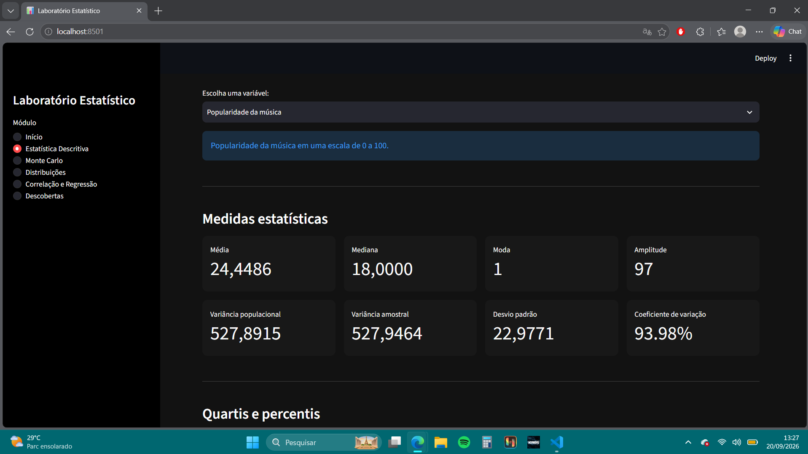
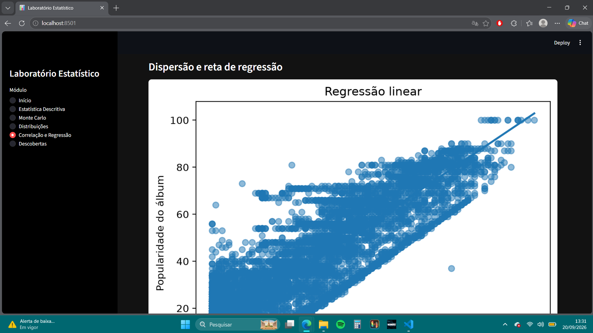
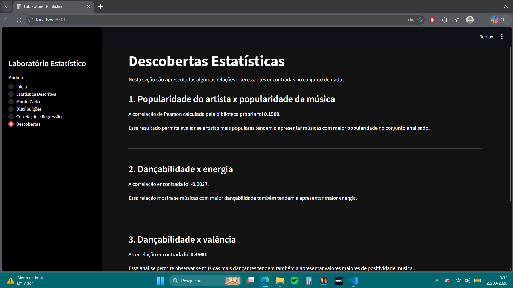

# Laboratório Estatístico Interativo

Aplicação desenvolvida em Python e Streamlit para análise estatística interativa de um conjunto real de dados do Spotify.

## Integrante

Nome: Giovanna Martins Maximo | Matrícula: 72650082

## Sobre o projeto

O projeto aplica conceitos de estatística e probabilidade por meio de uma aplicação interativa, permitindo explorar os dados, calcular medidas estatísticas, realizar simulações e analisar relações entre variáveis.

O núcleo estatístico foi desenvolvido de forma própria e separado da interface da aplicação. As funções implementadas foram validadas por meio de testes automatizados.

## Dataset

Foi utilizado o **Spotify Huge Track Analysis Dataset**, disponível no Kaggle:

https://www.kaggle.com/datasets/gildasledrogoff/spotify-huge-track-analysis-dataset

Após a filtragem dos dados, o conjunto utilizado na aplicação possui 9.616 registros, referentes a músicas de 10 artistas.

## Funcionalidades

A aplicação está organizada nos seguintes módulos:

* **Módulo 0: Preparação e exploração:** características gerais do dataset e variáveis utilizadas.
* **Módulo 1: Biblioteca estatística:** funções estatísticas implementadas manualmente e validadas.
* **Módulo 2: Estatística descritiva:** medidas estatísticas, tabelas, histogramas, boxplots e identificação de outliers.
* **Módulo 3: Monte Carlo:** simulações da Lei dos Grandes Números e do Teorema Central do Limite.
* **Módulo 4: Distribuições:** comparação dos dados com distribuições teóricas.
* **Módulo 5: Correlação e regressão:** correlação de Pearson, regressão linear, R² e previsão.
* **Módulo 6: Descobertas:** análise de três descobertas estatísticas obtidas a partir dos dados.

## Tecnologias

Python | Streamlit | Pandas | NumPy | SciPy | Matplotlib | Pytest

## Estrutura do projeto

```text
laboratorio-estatistico/
├── dados/
│   └── spotify_trabalho.csv
├── src/
│   ├── analise/
│   ├── stats/
│   │   └── minhastats.py
│   ├── utils/
│   ├── app.py
│   ├── explorar_dataset.py
│   └── filtrar_dataset.py
├── tests/
│   └── test_minhastats.py
├── README.md
├── RELATORIO.md
└── requirements.txt
```

## Como executar

Clone o repositório e acesse a pasta do projeto:

```bash
git clone URL_DO_REPOSITORIO
cd laboratorio-estatistico
```

Crie e ative um ambiente virtual:

```powershell
python -m venv .venv
.venv\Scripts\Activate.ps1
```

Instale as dependências:

```powershell
pip install -r requirements.txt
```

Execute a aplicação:

```powershell
python -m streamlit run src/app.py
```

## Testes automatizados

O projeto possui **19 testes automatizados** para validar as funções do núcleo estatístico.

Para executá-los:

```powershell
pytest
```


## Demonstração

### Estatística descritiva



### Correlação e regressão



### Descobertas estatísticas



## Relatório

O relatório completo da atividade está disponível em [`RELATORIO.md`](RELATORIO.md).


