# Relatório | Laboratório Estatístico Interativo

**Nome:** Giovanna Martins Maximo  | **Matrícula:** 72650082

## 1. Introdução

Este projeto apresenta um laboratório estatístico interativo desenvolvido em Python, utilizando Streamlit para a interface gráfica. O objetivo é aplicar conceitos de estatística descritiva, probabilidade, distribuições, correlação e regressão linear sobre um conjunto de dados musicais do Spotify.

O projeto foi organizado de forma a separar as funções estatísticas da interface da aplicação. As funções foram implementadas manualmente e validadas por meio de comparações com bibliotecas estatísticas, como NumPy e SciPy.

## 2. Dataset escolhido

O conjunto de dados utilizado contém informações sobre músicas, álbuns e artistas disponíveis no Spotify.

Dataset original:

https://www.kaggle.com/datasets/gildasledrogoff/spotify-huge-track-analysis-dataset

Após o processo de filtragem, foram selecionadas músicas de 10 artistas:

- Linkin Park
- Taylor Swift
- Michael Jackson
- Bad Bunny
- Twenty One Pilots
- Sabrina Carpenter
- Bring Me The Horizon
- Tame Impala
- One Direction
- The Neighbourhood

O conjunto final possui 9.616 registros e 27 colunas.

Foram utilizadas variáveis numéricas, como popularidade, energia, dançabilidade, instrumentalidade, valência, duração e andamento. Também foram utilizadas variáveis categóricas, como nome do artista, nome do álbum e indicação de conteúdo explícito.

A escolha do dataset foi motivada pela possibilidade de analisar características musicais e investigar relações estatísticas entre elas.

### 2.1. Visão geral do dataset

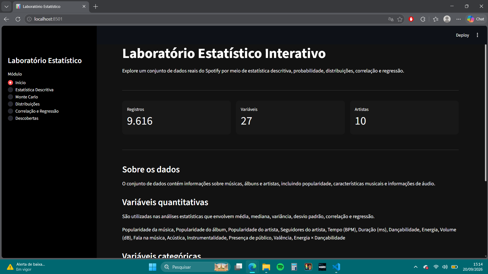

## 3. Organização e implementação do projeto

O projeto foi dividido em módulos para facilitar a organização, a manutenção e a validação do código.

A biblioteca estatística própria contém funções para:

- Média;
- Mediana;
- Moda;
- Amplitude;
- Variância populacional e amostral;
- Desvio-padrão populacional e amostral;
- Percentis e quartis;
- Coeficiente de variação;
- Covariância;
- Correlação de Pearson;
- Regressão linear;
- Coeficiente de determinação.

As bibliotecas estatísticas foram utilizadas principalmente para validação dos resultados, enquanto os cálculos apresentados ao usuário são realizados pelas funções próprias do projeto.

## 4. Módulo 1 | Implementação e validação estatística

As funções estatísticas foram implementadas manualmente, com o objetivo de compreender os cálculos e evitar a utilização direta de funções prontas para as medidas principais apresentadas na aplicação.

A validação foi realizada por meio de testes automatizados, comparando os resultados das funções próprias com os resultados obtidos por bibliotecas como NumPy, SciPy e statistics.

Foram realizados 19 testes automatizados, todos aprovados.

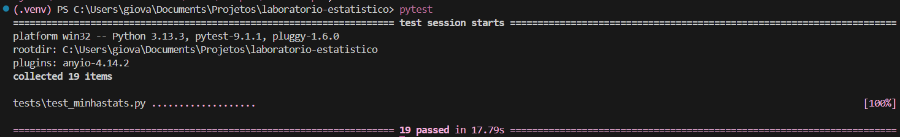

## 5. Módulo 2 | Estatística descritiva

O módulo de estatística descritiva permite selecionar variáveis numéricas e categóricas para analisar suas características.

Para as variáveis numéricas, a aplicação apresenta medidas como média, mediana, moda, amplitude, variância, desvio-padrão, quartis e coeficiente de variação. Também são apresentados histogramas, boxplots, tabelas de frequência e identificação de possíveis valores discrepantes por meio do intervalo interquartil.

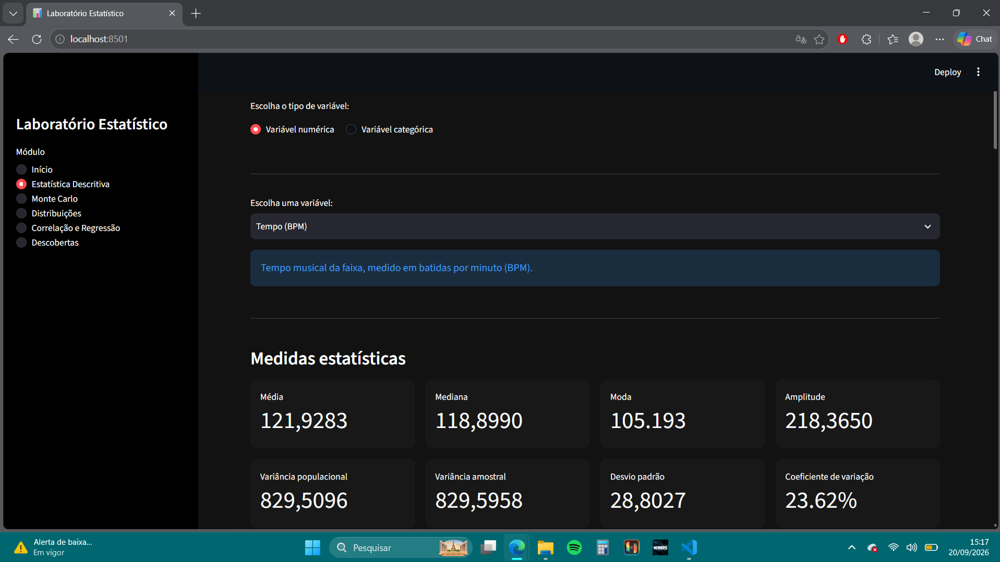

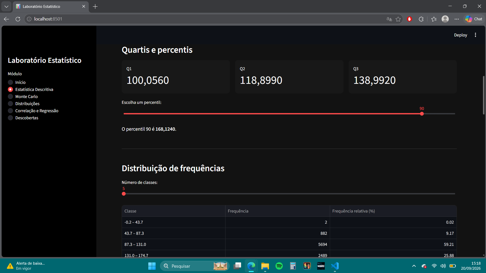

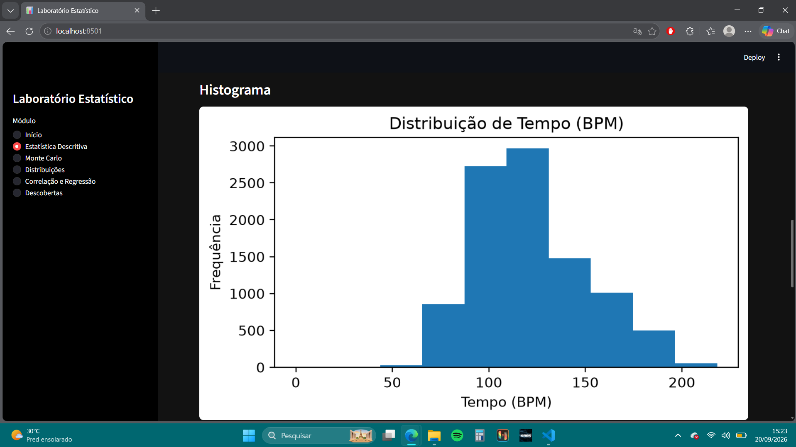

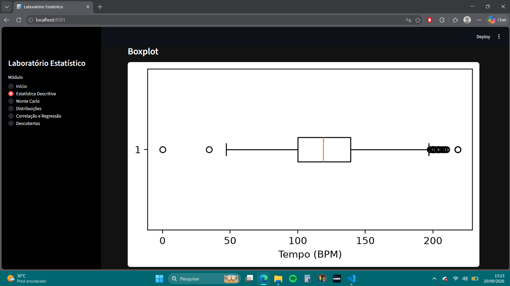

A análise descritiva permite observar a distribuição dos dados, identificar concentrações de valores e verificar a presença de possíveis valores discrepantes.

## 6. Módulo 3 | Simulações e probabilidade

### 6.1. Lei dos Grandes Números

A Lei dos Grandes Números foi explorada por meio de simulações aleatórias. Conforme o número de repetições aumenta, a média dos resultados tende a se aproximar do valor esperado teoricamente.

No aplicativo, foram realizadas simulações envolvendo lançamentos de dados e/ou moedas. Os resultados permitem observar a aproximação gradual entre a média experimental e o valor esperado.

A simulação demonstra que, embora os resultados individuais sejam aleatórios, a média tende a apresentar maior estabilidade com o aumento da quantidade de experimentos.

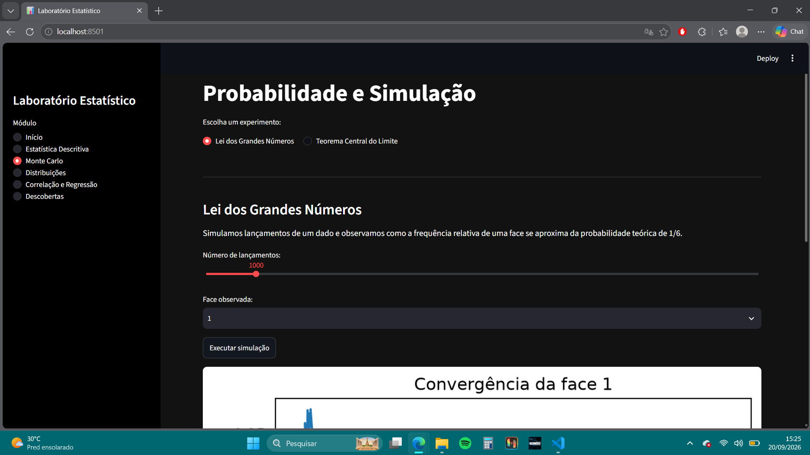

A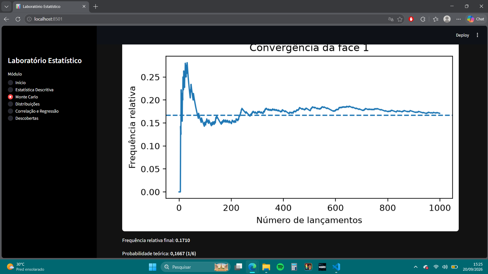

### 6.2. Teorema Central do Limite

O Teorema Central do Limite foi analisado por meio da seleção repetida de amostras e do cálculo de suas médias.

Mesmo quando os dados originais não apresentam uma distribuição normal, a distribuição das médias amostrais tende a se aproximar de uma distribuição normal à medida que o tamanho das amostras aumenta.

A simulação permite visualizar a distribuição das médias obtidas nas amostras e observar sua aproximação a um formato aproximadamente normal.
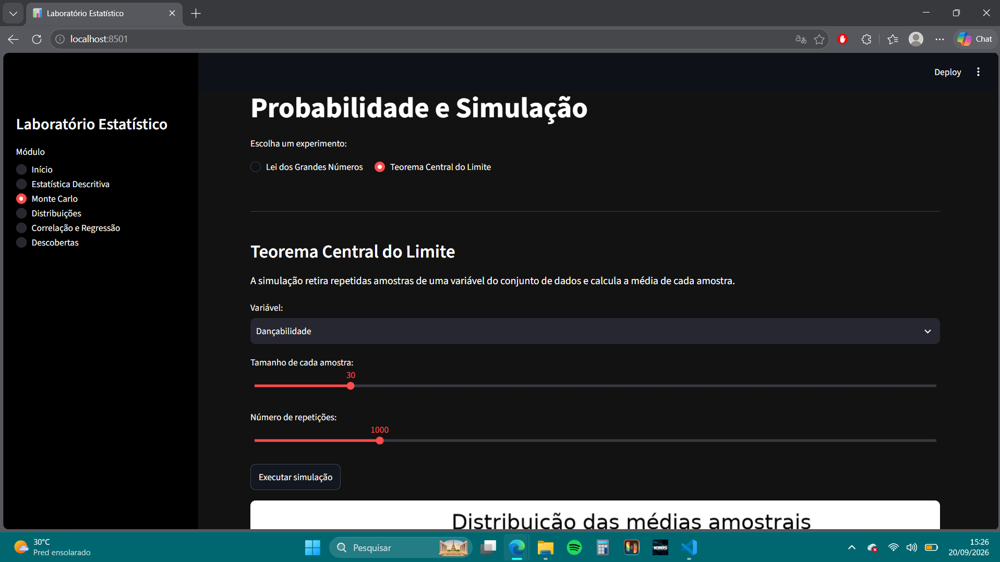

A

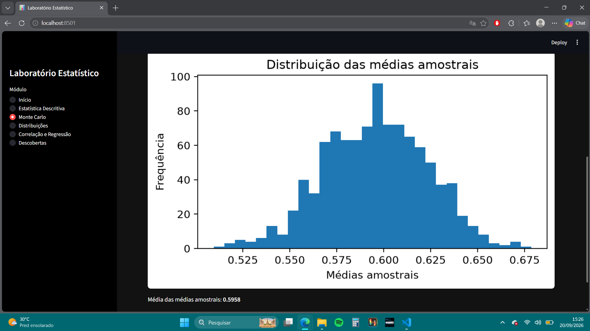

## 7. Módulo 4 | Distribuições de probabilidade

O módulo de distribuições apresenta uma comparação entre o histograma dos dados e modelos teóricos de probabilidade.

Foi implementada a distribuição normal, com parâmetros estimados a partir dos dados, utilizando a média e o desvio-padrão calculados pela biblioteca própria. Também foi implementada a distribuição uniforme, utilizando os valores mínimo e máximo da variável selecionada.

A comparação permite observar visualmente o quanto os modelos teóricos se aproximam da distribuição empírica dos dados.

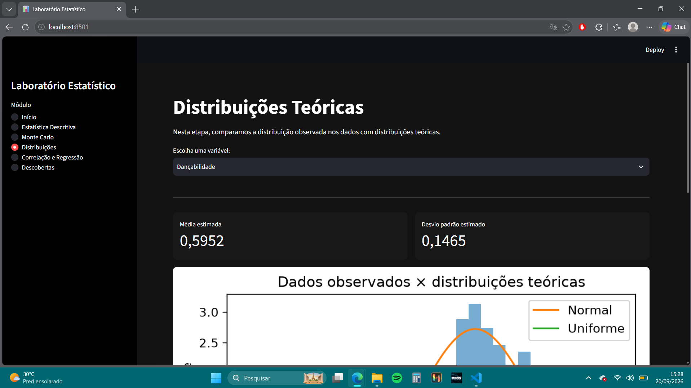

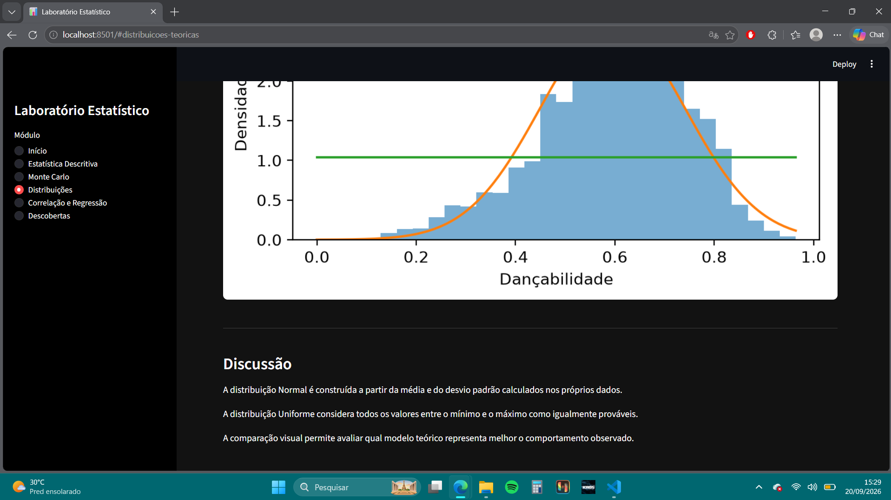

A comparação com modelos teóricos deve ser interpretada como uma análise visual e exploratória. A aproximação de uma distribuição teórica não significa necessariamente que os dados sigam exatamente aquele modelo.

## 8. Módulo 5 | Correlação e regressão linear

### 8.1. Variáveis analisadas

O exemplo principal utiliza as seguintes variáveis:

- **Variável independente (X):** Instrumentalidade;
- **Variável dependente (Y):** Energia;
- **Correlação de Pearson:** -0.0181;
- **Covariância:** -0.0006;
- **Coeficiente angular:** -0.0216;
- **Equação da regressão:** ŷ = -0.0216x + 0.6922;
- **Coeficiente de determinação (R²):** 0.0003.

### 8.2. Interpretação dos resultados

A análise entre instrumentalidade e energia apresentou uma correlação de Pearson de -0,0181, indicando uma relação linear praticamente inexistente entre as variáveis.

O coeficiente angular foi -0,0216, representando uma tendência negativa muito pequena na reta de regressão. A equação obtida foi ŷ = -0,0216x + 0,6922.

O coeficiente de determinação foi 0,0003, indicando que o modelo explica aproximadamente 0,03% da variação observada na energia. Dessa forma, a instrumentalidade não apresenta capacidade relevante de explicar a energia das músicas analisadas por meio desse modelo linear.

A correlação observada não deve ser interpretada como uma relação de causa e efeito.

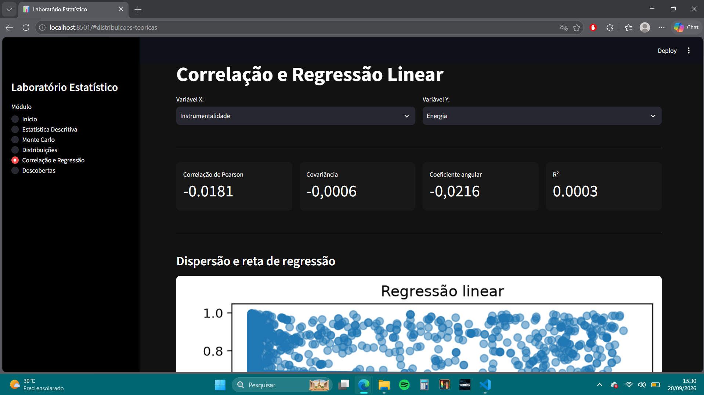

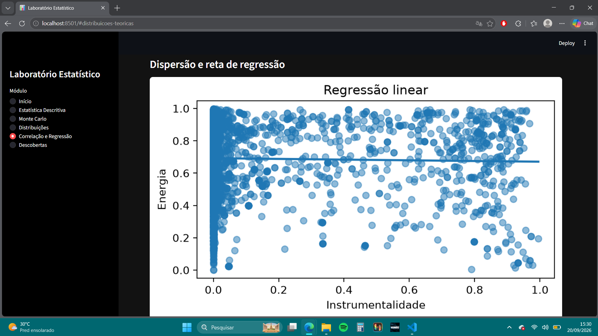

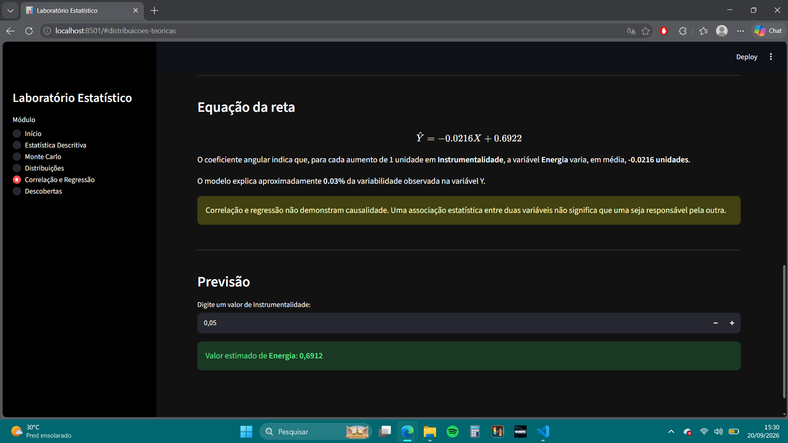

## 9. Módulo 6 | Descobertas estatísticasito.

## 10. Conclusão

O desenvolvimento do Laboratório Estatístico Interativo permitiu aplicar conceitos de estatística e probabilidade a um conjunto de dados reais relacionados à música.

A implementação de funções estatísticas próprias contribuiu para a compreensão dos cálculos de medidas descritivas, correlação e regressão. A validação com bibliotecas estatísticas e a execução de testes automatizados ajudaram a verificar a consistência dos resultados.

A interface interativa possibilitou explorar diferentes variáveis, visualizar distribuições, realizar simulações e investigar relações entre características musicais.

As análises realizadas demonstram que a estatística pode ser utilizada para identificar padrões e associações em dados, desde que os resultados sejam interpretados considerando as limitações dos modelos e a diferença entre correlação e causalidade.026.
